<!--
  SAKURAHUB: generated by _source/build_assets.py (the workflow in .github/ re-runs it every few hours).
  To change wording or layout, edit _source/build_assets.py, not this file: this file is rewritten.
  data source: offline fallback (no token)
-->

  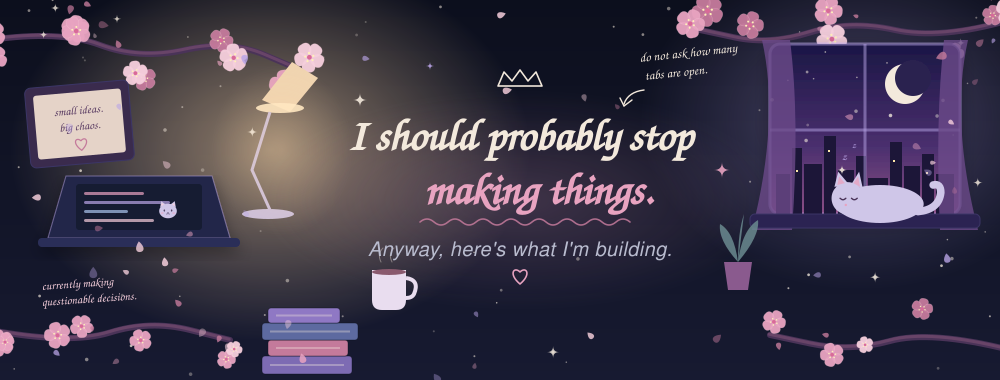

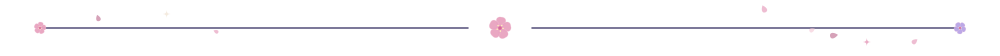

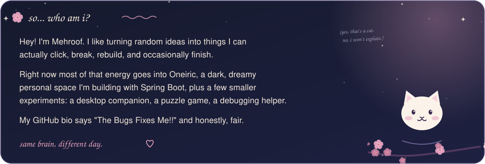

<table>
  <tr>
    <td width="50%" valign="top">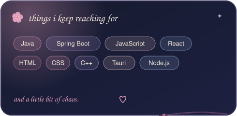</td>
    <td width="50%" valign="top">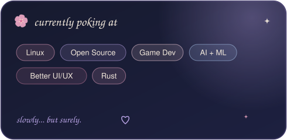</td>
  </tr>
</table>

<a href="https://github.com/mehroofsaba/Oneiric">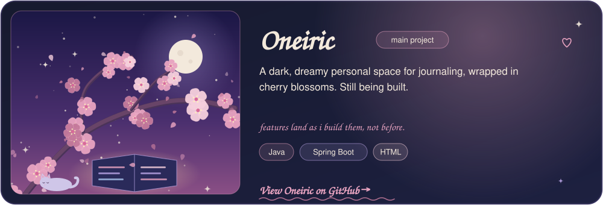</a>

<table>
  <tr>
    <td width="25%" valign="top"><a href="https://github.com/mehroofsaba/Wobble">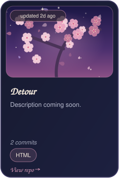</a></td>
    <td width="25%" valign="top"><a href="https://github.com/mehroofsaba/CyberDefuse">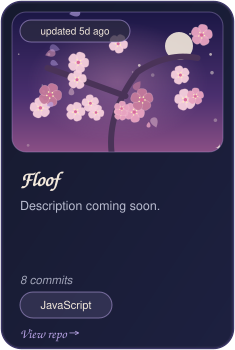</a></td>
    <td width="25%" valign="top"><a href="https://github.com/mehroofsaba/Hacktoberfest">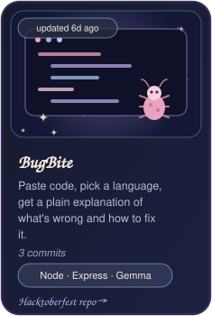</a></td>
    <td width="25%" valign="top"><a href="https://github.com/mehroofsaba/Portfolio">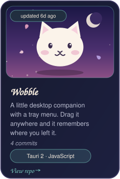</a></td>
  </tr>
</table>

<table>
  <tr>
    <td width="50%" valign="top"><a href="https://github.com/mehroofsaba/Calculator">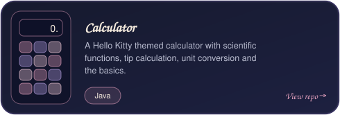</a></td>
    <td width="50%" valign="top"><a href="https://github.com/mehroofsaba/ChessMaster">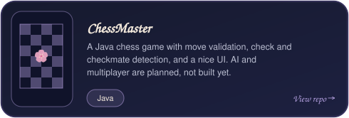</a></td>
  </tr>
</table>

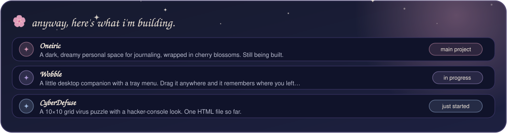

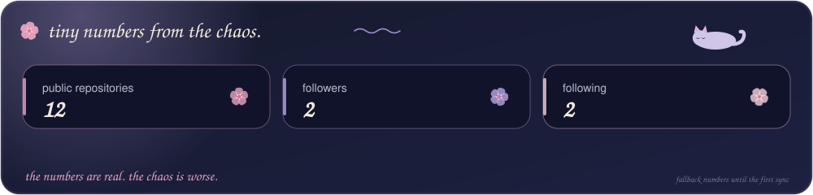

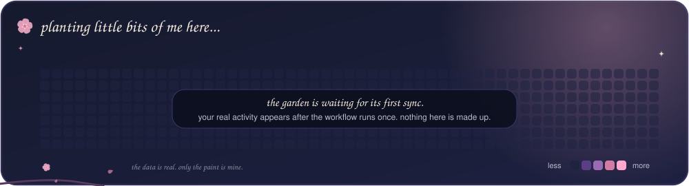

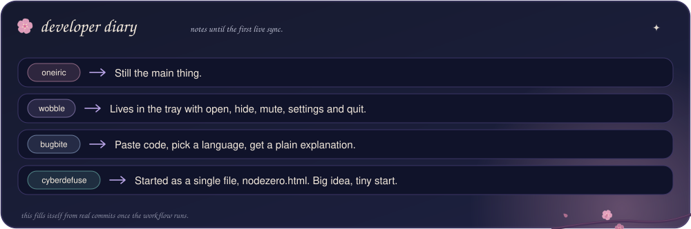

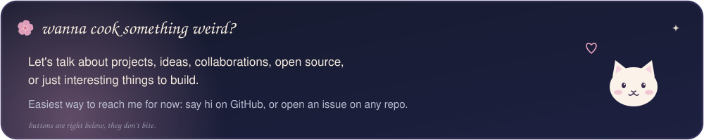

  
  

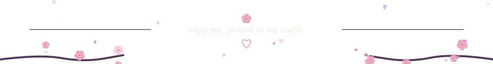
